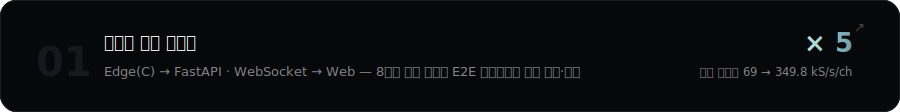
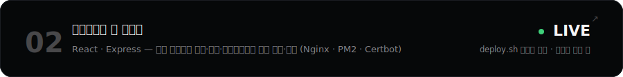
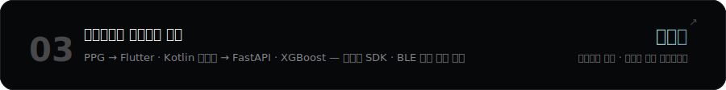
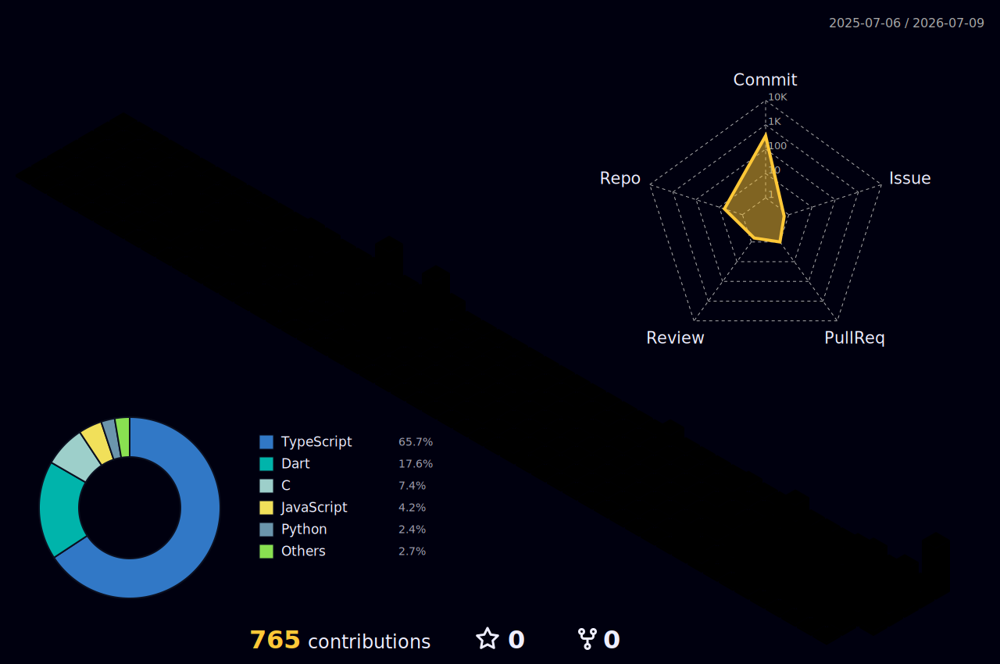

 
 

Frontend · Backend · Infra를 분리된 기술이 아니라 **하나의 서비스 흐름**으로 설계하는
 
Web & Mobile 풀스택 개발자 **박건호**입니다.

조선이공대학교 컴퓨터공학부 재학 (GPA 4.45 / 4.5) · 인공지능사관학교 5기 풀스택 과정 수료

 
 

 

## Now

**인테리어 시뮬레이션 서비스 (NestJS · MariaDB) — 백엔드 개발·운영 중**

도메인 API 고도화 · 로딩 성능 최적화 · 서버 관제/보안 대응 · CI/배포 검증 흐름

 

## Tech Stack

Also experienced — Kotlin · Dart · C / C++ / C# · Bash · Flask · JWT · Pandas / NumPy · Rocky Linux · systemd · UFW · OpenSSH · tmux · logrotate · NotebookLM

 

> **AI-Native Workflow** — Claude · Codex · Gemini를 설계 리뷰와 검증 파트너로 활용하되,  아키텍처 결정과 트레이드오프 판단은 직접 합니다. 도구가 바뀌어도 **원리 · 제약 · 검증** 기준은 지킵니다.

 

## Featured Projects

그 외 프로젝트 : [Phishing Signal MCP](https://github.com/DO-MADO/phishing-signal-mcp) · [STM32 Bare-Metal Porting](https://github.com/DO-MADO/Realtime-Sensor-Platform_STM32-Bare_Metal-Porting) · [레거시 쇼핑몰 결제 리팩터링](https://parkgeonhoportfolio.notion.site/UI-UX-23631721b589815f99d3ce79146dda1b) · [코사인 유사도 레시피 추천](https://parkgeonhoportfolio.notion.site/23631721b5898126bdd3e3ce77c5fcba)

 

## GitHub

 
 

 
 

<picture>
  <source media="(prefers-color-scheme: dark)" srcset="https://raw.githubusercontent.com/DO-MADO/DO-MADO/output/github-snake-dark.svg" />
  
</picture>

 

